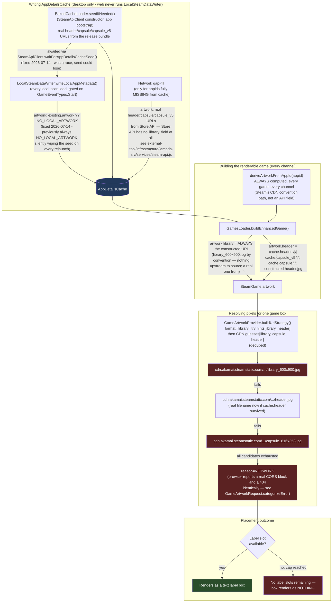

# Artwork Resolution Flow

Traces how a game box picks its artwork URL, and why the desktop local-scan flow (not web) was
regressing artwork. See `docs/bugs.md` for the two fixes this reflects (2026-07-14): preserving
existing artwork on a local-scan rewrite, and making the baked-cache seed a guaranteed
predecessor rather than a race.

## Key facts this settles

- **`artwork.library` is never sourced from Steam's Store API** — `AppDetailsData['artwork']`
  (the type both the Lambda and local-scan write into) only has `header`/`capsule`/`capsule_v5`/
  `background`/`background_raw`. `library_600x900.jpg` is a CDN path *convention*, constructed by
  `deriveArtworkFromAppId()` for every game on every channel — real data was never available to
  put there, on desktop or web.
- **The desktop-only symptom was the write side, not the fetch side.** `LocalSteamDataWriter` is
  the only thing that unconditionally overwrites `AppDetailsCache` entries with a placeholder
  artwork object, and it only runs on desktop (`isTauri()` no-ops it on web). Two bugs compounded:
  it always wrote `NO_LOCAL_ARTWORK` even over a real existing entry, and it had no guaranteed
  ordering against the baked-cache seed, so it could win a race and write first. Both fixed
  2026-07-14 - see `docs/bugs.md`.
- **Still open, structural, affects both platforms once triggered**: the CDN fetch itself
  (`cdn.akamai.steamstatic.com`) doesn't reliably send CORS headers to a browser `fetch()`,
  regardless of whether the URL came from a real Store API field or a guess. That's
  `cors-blocked-local-scan-artwork` / Round 3 (Tauri Rust HTTP client) territory, not resolved by
  either fix above.
