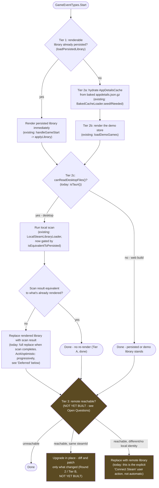

# Plan: Desktop Startup Load Ordering

**Status**: Draft — needs sign-off before implementation (see "Open questions" below).
**Parent feature**: [Native Desktop App](../features/desktop-app.md)
**Related**: [Desktop Offline-First Plan](desktop-offline-first-plan.md) (Tier A/B reconciliation
this plan assumes), [Desktop Local Data Pipeline Plan](desktop-local-data-pipeline-plan.md)

## Why this doc exists

The desktop double-render bug (see the offline-first plan's "Definitive root cause") was possible
because there is no single, designed startup sequence — there are **two independent listeners on
`GameEventTypes.Start`** (`SteamIntegration.handleGameStart()` and
`LocalSteamLibraryLoader.loadLocalSteamLibrary()`) that happen to produce a sane result because one
is fast (render persisted/demo) and the other is slow (scan + resolve), so the fast one always
finishes first by construction, not by design. Tier A (previous commit) stopped the slow one from
redundantly tearing down the fast one's work when nothing changed - but the ordering itself is
still implicit. This doc lays out what the ordering *should* be as an explicit priority cascade,
so future work builds on a designed sequence instead of another accidental race.

## Proposed cascade

Amber boxes are not implemented today - see "Open questions."

## Current-state gap analysis

| Tier | Description | Status |
|---|---|---|
| 1 | Render a persisted library immediately if one exists | **Done** — `handleGameStart()` |
| 2a | Hydrate `AppDetailsCache` from the baked gzip bundle | **Done** — `BakedCacheLoader.seedIfNeeded()`, awaited via `waitForAppDetailsCacheSeed()` |
| 2b | Render the demo store when nothing is persisted yet | **Done** — `loadDemoGames()` |
| 2c | Run local scan when desktop-capable; replace what's rendered if different | **Done, but implicitly sequenced** — `LocalSteamLibraryLoader` is a second, independent `GameEventTypes.Start` listener, not an explicit "after Tier 1/2b" step. It also runs on *every* launch regardless of Tier 1 (that's how second-launch change-detection works, not just a cold-cache fallback) - the "if I can get to local files" framing is slightly different from what's implemented: local scan always runs on desktop, it's the *render replacement* that's now conditional (Tier A). |
| 2c (replace) | Skip re-render when scan reproduces what's rendered | **Done** — Tier A, `isEquivalentToPersisted()` |
| 2c (progressive replace) | Phase the real library in instead of a hard cutover | **Not built** — deferred, see below |
| 3 | Background remote reconciliation after local render | **Not built for desktop.** Exists for the `online` channel only (`applyLibrary()`'s Fork A), and is explicitly excluded for `local-scan` - that exclusion is *why* desktop doesn't currently do this at all, not an oversight. |
| 3 (refresh, same identity) | Diff-and-patch instead of full replace | **Not built anywhere** — this is Round 2 / Tier B from the offline-first plan, a prerequisite for Tier 3 (see below) |

## Open questions (need your call before implementation)

1. **Should Tier 3 (automatic remote reconciliation) be built for desktop at all, and if so, when?**
   Fork A used to do something like this and was explicitly disabled for `local-scan` because it
   fired eagerly and blocking (40s Lambda round-trip, full scene reset, on every launch). A
   correctly-sequenced Tier 3 would only run *after* a local render already exists, and would need
   to be non-blocking - but it still needs **Tier B (upgrade-not-replace) built first**, or it
   reintroduces exactly the "tear down and rebuild an equivalent library" problem Tier A just
   fixed, just gated on network reachability instead of every launch. Recommend: sequence this
   after Tier B ships, not before. Confirm you agree, or if desktop should keep remote
   reconciliation as the explicit "Connect Steam" action indefinitely instead.
2. **`isTauri()` → a capability-named check.** Only 2 files call it directly
   (`LocalSteamLibraryLoader.ts`, `LocalSteamDataWriter.ts`), so a rename to something like
   `canReadDesktopFiles()` is small and mechanical - propose wrapping `isTauri()` in a
   named function at the call sites (or a thin local helper) rather than renaming the imported
   Tauri API itself. Low-risk; can be folded into whichever tier's implementation touches those
   files next, or done standalone first if you'd rather see it in isolation.
3. **Where does the "is this equivalent" comparison for Tier 3 live?** Tier A's
   `isEquivalentToPersisted()` (appid set + names) is deliberately coarse. Tier B's diff needs to
   be richer (per-appid: name changed? artwork changed - and per your earlier ask, *verified
   reachable* before replacing a working artwork URL). Worth deciding whether Tier B reuses/extends
   Tier A's comparison or is a separate mechanism before that implementation starts.

## Deferred: progressive load / no demo-library rug-pull

Explicitly flagged, not designed: if Tier 2c's replace (demo → real library, or persisted → scan
result) happens as a hard cutover, a user could see the demo store for only a few seconds before
it's replaced - or conversely, sit on a stale/wrong library while a slow scan runs. Two directions,
neither designed yet:
- **Progressive replacement**: patch in real games as they resolve rather than swapping the whole
  library at once (ties into Round 2/Tier B's per-appid patching once that exists).
- **Placeholders**: show *something* (a generic "loading" box) for slots whose real content isn't
  ready yet, rather than an empty shelf or a full-scene swap. This is the same underlying pattern
  as the already-captured [Loading placeholder boxes](../acts/act2-ready-for-friends.md) Act 2
  idea (game boxes whose artwork hasn't resolved) - applying it to "this whole shelf's identity
  hasn't resolved yet" is a natural extension, not a new mechanism.

Also flagged: **timing the demo→real transition** so a user never sees the demo library for an
uncomfortably short window before it's replaced. No design yet - explicitly deferred pending the
above.

---
*— A1*
