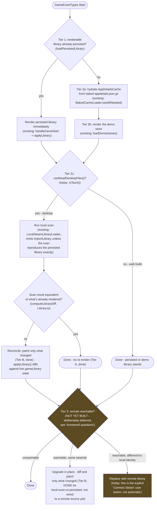

# Plan: Desktop Startup Load Ordering

**Status**: Open questions answered 2026-07-14. Tier B (diff-and-patch reconciliation) **implemented
this pass** for the local-scan-vs-persisted case — see "Current-state gap analysis" below. Tier 3
(automatic remote reconciliation) remains deliberately not built, per the answered questions.
**Parent feature**: [Native Desktop App](../features/desktop-app.md)
**Related**: [Desktop Offline-First Plan](desktop-offline-first-plan.md) (Tier A/B reconciliation
this plan assumes), [Desktop Local Data Pipeline Plan](desktop-local-data-pipeline-plan.md)

## Why this doc exists

The desktop double-render bug (see the offline-first plan's "Definitive root cause") was possible
because there is no single, designed startup sequence — there are **two independent listeners on
`GameEventTypes.Start`** (`SteamIntegration.handleGameStart()` and
`LocalSteamLibraryLoader.loadLocalSteamLibrary()`) that happen to produce a sane result because one
is fast (render persisted/demo) and the other is slow (scan + resolve), so the fast one always
finishes first by construction, not by design. Tier A (previous commit) stopped the slow one from
redundantly tearing down the fast one's work when nothing changed - but the ordering itself is
still implicit. This doc lays out what the ordering *should* be as an explicit priority cascade,
so future work builds on a designed sequence instead of another accidental race.

## Proposed cascade

Amber boxes are not implemented today - see "Answered questions."

## Current-state gap analysis

| Tier | Description | Status |
|---|---|---|
| 1 | Render a persisted library immediately if one exists | **Done** — `handleGameStart()` |
| 2a | Hydrate `AppDetailsCache` from the baked gzip bundle | **Done** — `BakedCacheLoader.seedIfNeeded()`. No ordering dependency on 2c's write anymore (see note below) - each writes independently and safely. |
| 2b | Render the demo store when nothing is persisted yet | **Done** — `loadDemoGames()` |
| 2c | Run local scan when desktop-capable; replace what's rendered if different | **Done, but implicitly sequenced** — `LocalSteamLibraryLoader` is a second, independent `GameEventTypes.Start` listener, not an explicit "after Tier 1/2b" step. It also runs on *every* launch regardless of Tier 1 (that's how second-launch change-detection works, not just a cold-cache fallback) - the "if I can get to local files" framing is slightly different from what's implemented: local scan always runs on desktop, it's the *render replacement* that's now conditional (Tier A). |
| 2c (replace) | Skip re-render when scan reproduces what's rendered | **Done** — Tier A, `computeLibraryDiff()`/`isDiffEmpty()` in `Library.ts`, called from the loader's own skip-check against `loadPersistedLibrary()` |
| 2c (reconcile, differs) | Diff-and-patch instead of full replace when the scan differs | **Done 2026-07-14, simplified 2026-07-15** — after a self-review pass (`startup-reload-review-findings.md` F1) the diff moved out of the loader entirely: `SteamIntegration.applyLibrary()` diffs the incoming library against *live* `gameLibrary` state (via the same `computeLibraryDiff()`) and passes `removedGameNames` straight to `StorePropsLibraryReloadRequestEvent` — no `SteamImportLibraryEvent.reconcile` field, no cross-layer plumbing. `GameBoxSpawner` picks a reconcile reset tier (`GpuGameBoxRenderer.reconcileForLibraryReload`) that only clears the removed/renamed games' texture-slot mappings — every other game's mapping (and its already-decoded artwork) is left untouched, so `prefetchArtwork()`'s existing cache-hit check makes re-resolving them a no-op. This also means bookmarklet/file re-imports get the same reconcile benefit for free, not just local-scan. Placement positions still fully recompute (cheap, no network/decode cost) — only the artwork layer is patched, not the shelf-layout layer (see the "Deferred" section below for why that's a separate, larger undertaking). |
| 2c (progressive replace) | Phase the real library in instead of a hard cutover | **Not built** — deferred, see below |
| 3 | Background remote reconciliation after local render | **Not built for desktop.** Exists for the `online` channel only (`applyLibrary()`'s Fork A), and is explicitly excluded for `local-scan` - deliberately deferred, see "Answered questions" below. |
| 3 (refresh, same identity) | Diff-and-patch instead of full replace | **The mechanism exists (Tier B, above)**, but nothing yet computes a diff against a *remote* fetch — only against the persisted local-scan library. Wiring Tier 3 to reuse it is future work. **Prerequisite when built**: `reconcileForLibraryReload` doesn't reclaim removed games' texture slots, which is harmless today (one reconcile per fresh-process launch) but leaks the atlas across *repeated in-session* reconciles — Tier 3's periodic refresh is exactly that. Needs slot reclamation / compaction on reconcile before shipping. Tracked as [`reconcile-slot-leak-on-repeated-reload`](../tech-debt.md#id-reconcile-slot-leak-on-repeated-reload), which [Idempotent Library Scene Sync](../features/idempotent-library-scene-sync.md) is meant to close as part of its diff step. |

**2026-07-15 addendum — the Tier 2a/2c write race is solved a level below this doc's diff-and-patch,
not by sequencing.** This doc's Tier B/3 diff-and-patch is about the *rendered game list* (which
games are on the shelf). A separate, lower-level race existed in `AppDetailsCache` itself: Tier 2a's
baked-cache seed and Tier 2c's local-scan write both populate the same cache with no ordering
guarantee between them, and one landing last could stomp real data the other just wrote (e.g. a
seeded artwork URL getting overwritten by local-scan's `NO_LOCAL_ARTWORK`). The original fix was an
event-based wait (`LocalSteamDataWriter` blocking on a `SteamApiClient` readiness signal before
touching the cache) - that's been replaced with `AppDetailsCache.mergeMany()`, which merges
per-field, per-entry (meaningful + at-least-as-new data wins per field, never a blind overwrite).
Neither writer needs to wait on the other anymore; whichever lands first is safe. This also means
Tier 3's eventual remote-refresh write can land through the same `mergeMany` with zero new
sequencing work - one more reason to prefer it over a bespoke Tier-3-specific merge.

## Answered questions (2026-07-14)

1. **Tier 3 sequencing**: confirmed — Tier B is diff-and-patch, and Tier 3 (automatic remote
   reconciliation) is not being built yet. It remains sequenced after Tier B, which is now done for
   the local-scan case; wiring it to a remote fetch is separate, not-yet-scoped work.
2. **`isTauri()`**: kept as a direct call, not wrapped — a one-line comment was added at each of the
   2 call sites (`LocalSteamLibraryLoader.ts`, `LocalSteamDataWriter.ts`) explaining the intent
   ("can this process read the local Steam install's files") rather than introducing a new function
   for a direct third-party API call.
3. **Comparison reuse**: taken further than originally proposed after the F1 self-review pass —
   `computeLibraryDiff()`/`isDiffEmpty()` moved to `Library.ts`, generalized to a minimal
   `{appid, name}` shape so `ImportedGame`/`LibraryGame`/`SteamGame` all satisfy it structurally.
   Tier A (the loader's own skip-check) and Tier B (`applyLibrary`'s reconcile diff) call the exact
   same function against different inputs; the bespoke `isEquivalentToPersisted()` wrapper that
   originally satisfied this answer was itself found to be dead code once `computeLibraryDiff` had
   real production callers, and was deleted (F2).

## Deferred: progressive load / no demo-library rug-pull

Explicitly flagged, not designed: if Tier 2c's replace (demo → real library, or persisted → scan
result) happens as a hard cutover, a user could see the demo store for only a few seconds before
it's replaced - or conversely, sit on a stale/wrong library while a slow scan runs. Two directions,
neither designed yet:
- **Progressive replacement**: patch in real games as they resolve rather than swapping the whole
  library at once (ties into Round 2/Tier B's per-appid patching once that exists).
- **Placeholders**: show *something* (a generic "loading" box) for slots whose real content isn't
  ready yet, rather than an empty shelf or a full-scene swap. This is the same underlying pattern
  as the already-captured [Loading placeholder boxes](../acts/act2-ready-for-friends.md) Act 2
  idea (game boxes whose artwork hasn't resolved) - applying it to "this whole shelf's identity
  hasn't resolved yet" is a natural extension, not a new mechanism.

Also flagged: **timing the demo→real transition** so a user never sees the demo library for an
uncomfortably short window before it's replaced. No design yet - explicitly deferred pending the
above.

---
*— A1*
